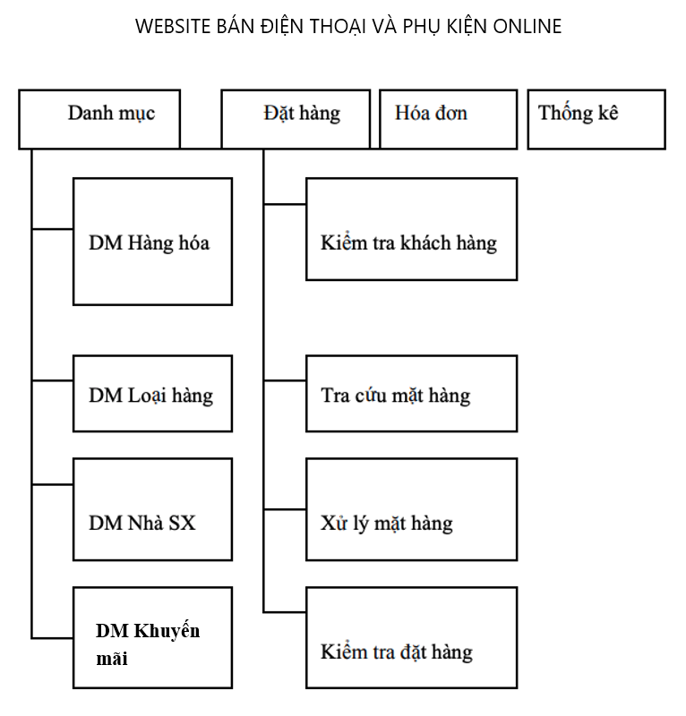

# ĐẶC TẢ YÊU CẦU PHẦN MỀM

## I - Giới thiệu

 Ngày nay, ứng dụng công nghệ thông tin và việc số hóa được xem là một trong những yếu tố mang tính quyết định trong hoạt động của các chính phủ, tổ chức, cũng như của các công ty, nó đóng vai trò hết sức quan trọng, có thể tạo ra những bước đột phá mạnh mẽ. 
 
 Cùng với sự phát triển không ngừng về kỹ thuật máy tính và mạng điện tử, công nghệ thông tin cũng được những công nghệ có đẳng cấp cao và lần lượt chinh phục hết đỉnh cao này đến đỉnh cao khác. Mạng Internet là một trong những sản phẩm có giá trị hết sức lớn lao và ngày càng trở nên một công cụ không thể thiếu, là nền tảng chính cho sự truyền tải, trao đổi thông tin trên toàn cầu. 
 
 Giờ đây, mọi việc liên quan đến thông tin trở nên thật dễ dàng cho người sử dụng: chỉ cần có một máy tính kết nối internet và một dòng dữ liệu truy tìm thì gần như lập tức… cả thế giới về vấn đề mà bạn đang quan tâm sẽ hiện ra, có đầy đủ thông tin, hình ảnh và thậm chí đôi lúc có cả những âm thanh nếu bạn cần… Bằng internet, chúng ta đã thực hiện được nhiều công việc với tốc độ nhanh hơn và chi phí thấp hơn nhiều so với cách thức truyền thống. 
 
 Chính điều này, đã thúc đẩy sự khai sinh và phát triển của thương mại điện tử và chính phủ điện tử trên khắp thế giới, làm biến đổi đáng kể bộ mặt văn hóa, nâng cao chất lượng cuộc sống con người. Trong hoạt động sản xuất, kinh doanh, giờ đây, thương mại điện tử đã khẳng định được vai trò xúc tiến và thúc đẩy sự phát triển của doanh nghiệp. Đối với một cửa hàng hay shop bán hàng, việc quảng bá và giới thiệu đến khách hàng các sản phẩm mới đáp ứng được nhu cầu của khác hàng sẽ là cần thiết. Vậy phải quảng bá thế nào đó là xây dựng được một Website cho cửa hàng của mình quảng bá tất cả các sản phẩm của mình bán. 
 
 Vì vậy, em đã thực hiện đồ án “XÂY DỰNG WEBSITE BÁN HÀNG  BẰNG CÔNG NGHỆ MERN STACK” cho một shop bán điện thoại và những sản phẩm có liên quan. Người chủ cửa hàng đưa các sản phẩm đó lên website của mình và quản lý bằng website đó. Khách hàng có thể đặt mua hàng trên website mà không cần đến cửa hàng. Chủ cửa hàng có thể quản lý được số lượng hàng hoá, người mua hàng, đánh giá như cầu mua hàng và thống kê doanh thu một cách tự động hoá.

## II - Yêu cầu đề tài

### 1. Chức năng:

 - Đây là một website bán và giới thiệu sản phẩm của cửa hàng (công ty) đến khách hàng với các chi tiết mặt hàng với giá cả chính xác. 
 - Có các chứa năng sau: 
    - Cho phép thêm, sửa, xoá các loại mặt hàng, doanh mục sản phẩm cũng, … vào cơ sở dữ liệu. 
    - Hiển thị danh sách các mặt hàng, ngành hàng, thương hiệu theo từng loại. 
    - Hiển thị hàng hoá khách hàng đã chọn mua. 
    - Hiển thị thông tin khách hàng 
    - Quản lý đơn đặt hàng 
    - Cập nhật hàng hoá, nhà sản xuất, loại hàng, tin tức. 
    - Xử lý đơn hàng. 
    - Tra cứu dữ liệu về hàng hoá, nhà sản xuất, loại hàng.
    - Quản lý khuyến mãi.
    - Thống kê các khách hàng mua trong ngày,trong khoảng thời gian.
    - Giao tiếp giữa khách hàng và nhân viên bán hàng trực tuyến.

### 2. Yêu cầu:

Hệ thống có 2 phần: 

#### Thứ nhất - Phần khách hàng : Khách hàng là những người có nhu cầu mua sắm hàng hóa, họ sẽ tìm kiếm các mặt hàng cần thiết từ hệ thống và đặt mua các mặt hàng này. 

  Vì thế phải có các chức năng sau: 

  - Hiển thị danh sách các mặt hàng của cửa hàng để khách hàng xem, lựa chọn và mua. (theo từng danh mục hàng theo từng yêu cầu khác nhau).
  - Khách hàng xem các thông tin tin tức mới, khuyến mãi, chính sách trên trang web.
  - Khách hàng có thể tìm kiếm các sản phẩm theo tên, theo danh mục, nhà sản xuất, ....
  - Khách hàng có thể nhắn tin trực tiếp ở trang web để trò chuyện với nhân viên bán hàng để tìm hiểu về sản phẩm cũng như tin tức khuyến mãi hoặc các tin tức liên quan.
  - Xem đánh giá sản phẩm, đánh giá sản phẩm.
  - Thêm sản phẩm vào giỏ hàng và xem giỏ hàng.
  - Sau khi khách hàng chọn và đặt hàng hàng trực tiếp thì phải hiện lên đơn hàng để khách hàng có thể nhập thông tin mua hàng và xem hoá đơn mua hàng.

#### Thứ hai - Phần quản trị viên: Người làm chủ ứng dụng có quyền kiềm soát mọi hoạt động của hệ thống. Người này được cấp username và password để đăng nhập hệ thống thực hiện chức năng của mình:

  - Chức năng cập nhật, sửa, xoá các mặt hàng, loại hàng, nhà sản xuất, tin tức.(phải kiểm soát được hệ thống). Nó đòi hỏi sự chính xác. 
  - Tiếp nhận kiểm tra đơn đặt hàng của khách hàng. Hiển thị đơn đặt hàng. 
  - Thống kê doanh thu, sản phẩm bán được, ... theo ngày, khoảng thời gian cố định (tháng, quý, năm).
  - Trả lời yêu cầu của khách hàng.
  - Tạo đơn hàng khi mua trực tiếp.

- Ngoài các chức năng trên thì trang Web phải được thiết kế sao cho dễ hiểu, giao diện mang tính dễ dùng đẹp mắt và làm sao cho khách hàng thấy được thông tin cần tìm, cung cấp các thông tin quảng cáo hấp dẫn, các tin tức khuyến mãi để thu hút khách hàng. Điều quan trọng là phải đảm bảo an toàn tuyệt đối thông tin khách hàng trong quá trình đặt mua qua mạng. Đồng thời trang Web phải luôn đổi mới, hấp dẫn
  

## III - Phân tích và thiết kế hệ thống:

### 1. Khảo sát hiện trạng và xây dựng hệ thống:

  Sau khi khảo sát em đã nắm bắt được các thông tin : 

  - Quản lý khách hàng : Mỗi khách hàng được quản lý các thông tin sau: họ tên, địa chỉ, số điện thoại, fax, email. 
  - Quản lý hàng hoá: mã hàng hoá, tên hàng hoá, đơn giá, số lượng, hình ảnh, chi tiết, mã loại hàng,tên loại hàng. 
  - Quản lý nhà sản xuất:mã nhà sx, tên nhà sx 
  - Quản lý tin tức: Mã tin, Tên tin, mục tin, chi tiết tin 
  - Xử lý được đơn hàng và thống kê.

### 2. Thiết kế hệ thống

 
